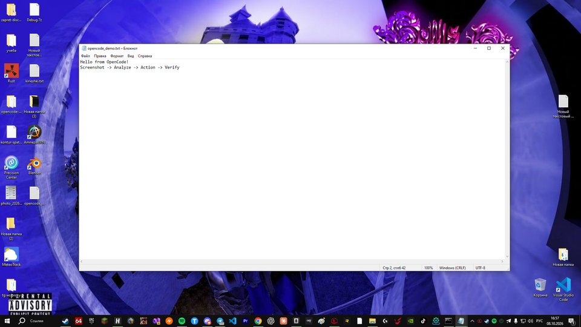

# OpenCode Computer Use — local Codex-style visual desktop control for Windows

MCP server (stdio) that gives OpenCode **eyes + hands** on a Windows PC:
screenshots, DPI-correct mouse, Unicode keyboard, window management,
UI Automation, OCR fallback, batch actions, wait/verify primitives, and a
safety layer with emergency stop.

No cloud services. No shell execution. GUI control only.


- Transport: **stdio** · Client: **OpenCode** (compatible with any MCP client)
- Platform: **Windows 10/11 x64** (developed and verified on Windows 10)
- Language: **Python 3.10+** (`ctypes` + `mss` + official MCP SDK)

## Capabilities

- `computer_screenshot` — per-monitor / all-monitors / region, downscaled with
  coordinate-scale reporting, returned as MCP **image content**
- 8 mouse tools: move, click, double-click, down, up, drag, scroll, position
  (`left|right|middle`), DPI-correct via `SendInput VIRTUALDESK|ABSOLUTE`
- 5 keyboard tools: type (Unicode: Latin + Cyrillic), key, hotkey, key down/up;
  clipboard fallback for long text
- 6 window tools: list, active, focus, minimize, maximize, restore
- OCR: `computer_ocr`, `computer_find_text`, `computer_click_text`
  (optional `rapidocr-onnxruntime`, offline)
- UI Automation: `computer_ui_tree`, `computer_find_element`,
  `computer_invoke_element` (optional `comtypes`, offline)
- Element priority: **UIA → OCR → visual coordinates**
- `screenshot_after` on actions: result screenshot inline, no extra tool call
- `computer_batch` — sequential actions, stops on first error
- `computer_wait`, `computer_wait_for_text`, `computer_wait_for_window`,
  `computer_element_exists`
- **Single-monitor lock**: agent physically cannot act outside one monitor
- On-screen **"OpenCode using your computer" banner** (OpenCode dark theme,
  click-through, auto-shows on input, auto-hides when idle)
- Safety: no shell/PowerShell/shutdown tools exist; safe vs autonomous modes;
  `computer_emergency_stop` kill-switch

## Architecture

```text
OpenCode ── MCP/stdio ──► Computer Use MCP Server (server.py)
                              ├── capture.py      mss per-monitor screenshots
                              ├── mouse.py        SendInput VIRTUALDESK|ABSOLUTE
                              ├── keyboard.py     SendInput UNICODE + clipboard
                              ├── monitors.py     EnumDisplayMonitors + per-monitor DPI
                              ├── windows_mgr.py  EnumWindows/focus/show
                              ├── ocr.py          RapidOCR (optional)
                              ├── uia.py          UIAutomationCore via comtypes (optional)
                              ├── coords.py       CoordinateMapper (single source of truth)
                              ├── safety.py       policy + emergency stop + risk gate
                              └── config.py       env settings + stderr logging
```

Coordinate pipeline (never assumes screenshot px == screen px):

```text
model coords ──(/scale)──► screenshot px ──(+origin)──► virtual-desktop px
      ──► SendInput absolute (0..65535, VIRTUALDESK) / UIA physical rects
```

Agent loop: `SCREENSHOT → ANALYZE → ACTION(+screenshot_after) → VERIFY → …`

## Installation

```powershell
git clone <repo> opencode-computer-use
cd opencode-computer-use
pip install -e .
# optional (offline, on-device):
pip install -e ".[ocr]"    # RapidOCR text search
pip install -e ".[uia]"    # Windows UI Automation tree
pip install -e ".[all]"    # everything
```

Windows permissions: run in an **active desktop session** (unlocked screen).
No admin required, except for driving elevated windows (use UIAccess install
in that case). First run may trigger firewall/smart-screen prompts — allow local only.

## OpenCode configuration

Add to `opencode.json` (see `opencode.json.example`):

```json
{
  "mcp": {
    "computer-use": {
      "type": "local",
      "command": ["python", "-m", "opencode_computer_use"],
      "enabled": true,
      "timeout": 60000
    }
  }
}
```

Then: restart OpenCode → `computer_*` tools appear. Verify with
“list my monitors” → `computer_list_monitors`.

## Available tools (35)

Screen/monitors: `computer_screenshot`, `computer_list_monitors`.
Mouse: `computer_mouse_move/click/double_click/down/up/drag/scroll/position`.
Keyboard: `computer_type/key/hotkey/key_down/key_up`.
Windows: `computer_list_windows/get_active_window/focus_window/minimize_window/maximize_window/restore_window`.
OCR: `computer_ocr/find_text/click_text`.
UIA: `computer_ui_tree/find_element/invoke_element`.
Sync: `computer_wait/wait_for_text/wait_for_window/element_exists`.
Flow: `computer_batch`, `computer_emergency_stop`.
Banner: `computer_overlay_show`, `computer_overlay_hide`.

Actions return agent-friendly context: what happened, cursor pos, active
window, and optionally the next screenshot inline.

## Examples

Notepad end-to-end (real verified loop):



```text
hotkey WIN+R → type "notepad" → key ENTER → wait_for_window "Notepad"
→ type "Hello from OpenCode! Привет мир!" → hotkey CTRL+S
→ type "C:\Users\you\Desktop\hello.txt" → key ENTER → screenshot
```

Locked to one monitor (`config/opencode.single-monitor.json.example`):

```json
{ "env": { "COMPUTER_USE_SINGLE_MONITOR": "1", "COMPUTER_USE_MONITOR": "1" } }
```

Batch:

```json
{ "actions": [
  {"type": "click", "x": 500, "y": 400},
  {"type": "type", "text": "Hello"},
  {"type": "hotkey", "keys": ["CTRL", "S"]},
  {"type": "wait", "seconds": 1.0}
], "screenshot_after": true }
```

## Multi-monitor & DPI

- Monitors enumerated with virtual-desktop origins (negative allowed),
  per-monitor DPI scale (1.0/1.25/1.5/2.0), primary flag.
- Process is per-monitor-V2 DPI aware; cursor read via `GetPhysicalCursorPos`.
- Unit tests (`tests/test_coords.py`) pin transforms incl. negative offsets,
  region offsets, 150% DPI, absolute-unit corners.
- `monitor="all"` stitches the virtual desktop; default targets one monitor.

## Security

- No shell, PowerShell, file, registry, shutdown, or reboot tools — GUI only.
  Shell stays OpenCode's job.
- `COMPUTER_USE_ALLOW_MOUSE/KEYBOARD/WINDOW` (default 1) can disable input classes.
- Safe mode (default): risky text (shutdown/format/delete/purchase patterns,
  EN+RU) is refused; set `COMPUTER_USE_AUTONOMOUS=1` to allow.
- `computer_emergency_stop` disables mouse+keyboard; `reset=true` re-enables.
- Typed text is never logged (length only). All logs go to **stderr**
  (stdout is reserved for MCP framing).

## Troubleshooting

| Symptom | Fix |
|---|---|
| `SendInput keyboard failed err=87` | Fixed in 0.1.0 (40-byte `INPUT` union); update |
| Clicks land wrong on mixed-DPI | Ensure no other DPI-unaware hook; check `computer_list_monitors` scales |
| OCR/UIA tools return ERROR text | `pip install -e ".[ocr]"` / `".[uia]"` |
| Tool calls time out | Raise client timeout to 60000; screenshots at `scale` 0.5 are 4× smaller |
| Black screenshots | Session locked or RDP minimized — need active desktop |
| Server starts but tools hang | Update MCP Python SDK (`pip install -U mcp`); this server never raises from tools, errors are inline text |

## Development & testing

```powershell
pip install -e ".[all]"      # + pytest
python -m pytest tests/test_coords.py -q
python tests/e2e_mcp_calls.py   # protocol + tools smoke (moves mouse harmlessly)
COMPUTER_USE_SINGLE_MONITOR=1 COMPUTER_USE_MONITOR=1 python tests/e2e_lock.py
python tests/e2e_notepad.py     # full Notepad save-to-Desktop acceptance loop
python tests/e2e_cyrillic.py    # byte-exact Cyrillic roundtrip
```

Environment variables: `COMPUTER_USE_LOG_LEVEL` (ERROR/WARN/INFO/DEBUG),
`COMPUTER_USE_SINGLE_MONITOR`, `COMPUTER_USE_MONITOR`,
`COMPUTER_USE_AUTONOMOUS`, `COMPUTER_USE_ALLOW_MOUSE/KEYBOARD/WINDOW`,
`COMPUTER_USE_MAX_WIDTH` (default 1920), `COMPUTER_USE_JPEG_QUALITY`,
`COMPUTER_USE_SCREENSHOT_AFTER`, `COMPUTER_USE_OVERLAY_AUTO` (default 1:
banner appears on any mouse/keyboard action),
`COMPUTER_USE_OVERLAY_TEXT`, `COMPUTER_USE_OVERLAY_IDLE_SEC` (default 10).

## On-screen banner

While the agent drives the GUI, a topmost pill in the OpenCode dark theme
sits at the top-center: green dot + “OpenCode using your computer” +
“Do not touch mouse / keyboard”. It is **click-through**
(`WS_EX_TRANSPARENT`): agent and user clicks pass under it, so it can never
block automation. Auto-mode shows it on the first input action and hides it
after `COMPUTER_USE_OVERLAY_IDLE_SEC` idle seconds; `computer_overlay_show`
pins it sticky, `computer_overlay_hide` removes it.

## License

MIT. See LICENSE (add your preferred text).
